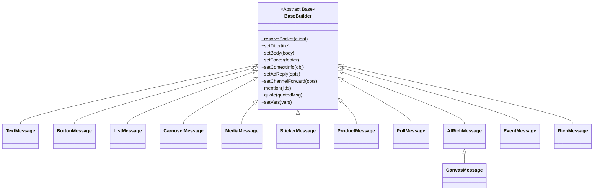
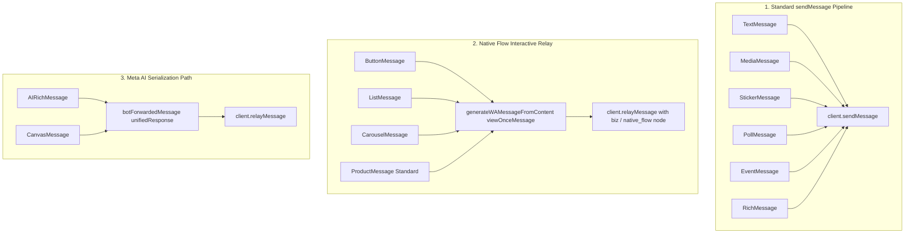

# Builder Methods API Reference

`leaves-guardian` provides a unified, object-oriented suite of **12 Message Builders** built on top of a common abstract base class (`BaseBuilder`). This document serves as the formal API reference specifying inheritance, method signatures, argument types, return values, template interpolation rules, Baileys serialization behavior, and common validation errors.

---

## 1. Architectural Model & BaseBuilder Inheritance

All 12 message builders inherit from `BaseBuilder` (or inherit transitively, such as `CanvasMessage` extending `AIRichMessage`).



### Socket Resolution Contract

Every message builder requires a socket or client instance passed to its constructor.

```js
import { ButtonMessage, LeavesClient } from 'leaves-guardian';

// Using LeavesClient
const client = new LeavesClient({ /* ... */ });
const btn = new ButtonMessage(client);

// BaseBuilder internally resolves the active socket:
// BaseBuilder.resolveSocket(client)
```

- **`BaseBuilder.resolveSocket(client)`**: Resolves the underlying socket from a supported client/socket input (e.g. calling `client.getRawSocket()` if a `LeavesClient` instance is provided, or using the direct socket object). Throws `Error('Socket Baileys wajib di-pass ke constructor')` if the parameter is nullish.

### Fluent Chaining Convention

Builder mutation methods generally support fluent chaining and return the builder instance (`this`) unless otherwise specified (such as factory methods like `CarouselMessage.prototype.newCard()`, static helpers, or asynchronous dispatch methods like `send()`).

---

## 2. Shared BaseBuilder Methods API

The following methods are inherited by all concrete message builders:

| Method | Signature | Parameters & Types | Return Value | Description |
| :--- | :--- | :--- | :--- | :--- |
| `setTitle` | `(title: string)` | `title`: `string` | `this` | Sets the main title/header string. |
| `setBody` | `(body: string)` | `body`: `string` | `this` | Sets the primary body text. |
| `setFooter` | `(footer: string)` | `footer`: `string` | `this` | Sets the small footer caption text. |
| `setContextInfo` | `(obj: object)` | `obj`: `Record<string, any>` | `this` | Merges custom Baileys `contextInfo` fields. |
| `setAdReply` | `(opts: object)` | `opts`: `AdReplyOptions` | `this` | Attaches rich link preview metadata (`externalAdReply`). |
| `setChannelForward` | `(opts: object)` | `opts`: `ChannelForwardOptions` | `this` | Configures forwarded newsletter / channel header metadata. |
| `mention` | `(jids: string \| string[])` | `jids`: `string \| string[]` | `this` | Appends JIDs to `mentionedJid` context info. |
| `quote` | `(quotedMsg: object)` | `quotedMsg`: `WAMessage \| object` | `this` | Attaches quoted message for reply threading context. |
| `setVars` | `(vars: object)` | `vars`: `Record<string, any>` | `this` | Sets dictionary for `{{varName}}` template interpolation. |

### Template Interpolation Engine

All text rendered through `BaseBuilder` supports `{{variable}}` placeholders. When `setVars({ name: 'Alex' })` is provided:
- Placeholder `{{name}}` is replaced with the string representation of `Alex`.
- Unmatched placeholders are preserved as literal text (e.g. `{{unknown}}` remains `{{unknown}}`).
- Interpolation is executed lazily when `build()` or `send()` is invoked.

---

## 3. Builder Specification Catalog

### 3.1 TextMessage

Plain text message builder with link preview control and context metadata.

- **Import:** `import { TextMessage } from 'leaves-guardian';`
- **Constructor:** `new TextMessage(client)`

| Method | Signature | Return Value | Description |
| :--- | :--- | :--- | :--- |
| `disableLinkPreview` | `()` | `this` | Disables automatic URL link preview rendering (`linkPreview = false`). |
| `build` | `()` | `object` | Returns Baileys `{ text, mentions, linkPreview, contextInfo }` object. |
| `send` | `async (jid: string, options?: object)` | `Promise<WAMessage>` | Validates body and sends text message via `client.sendMessage`. |

---

### 3.2 ButtonMessage

Interactive button message with quick reply, CTA URL, CTA Copy, banner badges, and optional header media.

- **Import:** `import { ButtonMessage } from 'leaves-guardian';`
- **Constructor:** `new ButtonMessage(client)`

| Method | Signature | Return Value | Description |
| :--- | :--- | :--- | :--- |
| `addReply` | `(displayText: string, id: string)` | `this` | Adds a quick-reply action button (`quick_reply`). |
| `addUrl` | `(displayText: string, url: string)` | `this` | Adds an external URL call-to-action button (`cta_url`). |
| `addCopy` | `(displayText: string, copyCode: string)` | `this` | Adds a one-tap clipboard copy button (`cta_copy`). |
| `addLimitedOffer` | `(displayText: string, opts?: object)` | `this` | Adds a promotional limited offer button with optional countdown/badge. |
| `setBanner` | `(bannerText: string, opts?: object)` | `this` | Alias for configuring banner text on promotional buttons. |
| `setImage` | `(source: string \| Buffer)` | `this` | Attaches image header (URL, file path, or Buffer). |
| `setVideo` | `(source: string \| Buffer)` | `this` | Attaches video header. |
| `setDocument` | `(source: string \| Buffer, options?: object)` | `this` | Attaches document header with optional `fileName` and `mimetype`. |
| `build` | `async ()` | `Promise<object>` | Prepares media attachments and builds Native Flow interactive payload. |
| `send` | `async (jid: string, options?: object)` | `Promise<WAMessage>` | Relays Native Flow message wrapped in `viewOnceMessage` with `biz` node. |

---

### 3.3 ListMessage

Interactive menu selector supporting categorized sections and single-choice rows.

- **Import:** `import { ListMessage } from 'leaves-guardian';`
- **Constructor:** `new ListMessage(client)`

| Method | Signature | Return Value | Description |
| :--- | :--- | :--- | :--- |
| `setButtonText` | `(text: string)` | `this` | Sets menu trigger button label (default: `'Pilih'`). |
| `addSection` | `(sectionTitle: string, rows: ListRow[])` | `this` | Adds a section containing row items `{ id, title, description?, header? }`. |
| `findRow` | `(id: string)` | `ListRow` | Looks up a row by its ID; throws `ItemNotFoundError` if not found. |
| `build` | `async ()` | `Promise<object>` | Validates sections and constructs `single_select` Native Flow payload. |
| `send` | `async (jid: string, options?: object)` | `Promise<WAMessage>` | Relays `single_select` interactive message with `biz` node. |

---

### 3.4 CarouselMessage

Horizontal multi-card carousel slider. Each card contains its own header media, title, body, footer, and buttons.

- **Import:** `import { CarouselMessage } from 'leaves-guardian';`
- **Constructor:** `new CarouselMessage(client)`

| Method | Signature | Return Value | Description |
| :--- | :--- | :--- | :--- |
| `addCard` | `(cardOrFn: ((card: CarouselCard) => void) \| CarouselCard)` | `this` | Adds a card via builder callback function or card instance. |
| `newCard` | `(id: string)` | `CarouselCard` | Creates and returns a new `CarouselCard` instance registered under `id`. |
| `build` | `async ()` | `Promise<object>` | Validates minimum 2 cards, uploads card media, and creates carousel payload. |
| `send` | `async (jid: string, options?: object)` | `Promise<WAMessage>` | Relays interactive carousel message with `biz` node. |

#### CarouselCard Methods

| Method | Signature | Return Value | Description |
| :--- | :--- | :--- | :--- |
| `setTitle` | `(title: string)` | `this` | Sets card header title. |
| `setBody` | `(body: string)` | `this` | Sets card body text. |
| `setFooter` | `(footer: string)` | `this` | Sets card footer text. |
| `setImage` | `(source: string \| Buffer)` | `this` | Sets card header image. |
| `addReply` | `(displayText: string, id: string)` | `this` | Adds quick-reply button to card. |
| `addUrl` | `(displayText: string, url: string)` | `this` | Adds CTA URL button to card. |
| `addCopy` | `(displayText: string, copyCode: string)` | `this` | Adds CTA copy button to card. |

---

### 3.5 MediaMessage

Unified media builder for image, video, document, audio, and sticker payloads.

- **Import:** `import { MediaMessage } from 'leaves-guardian';`
- **Constructor:** `new MediaMessage(client, type = 'image')`

| Method | Signature | Return Value | Description |
| :--- | :--- | :--- | :--- |
| `setType` | `(type: 'image' \| 'video' \| 'document' \| 'sticker' \| 'audio')` | `this` | Updates media type. Validates against supported types. |
| `setSource` | `(source: string \| Buffer)` | `this` | Sets media source (HTTP URL, local file path, or Buffer). |
| `setFileName` | `(name: string)` | `this` | Sets document filename (mandatory for `type === 'document'`). |
| `setMimetype` | `(mimetype: string)` | `this` | Sets explicit MIME type (e.g. `application/pdf`, `audio/ogg`). |
| `asVoiceNote` | `()` | `this` | Sets `ptt = true` (valid only for `type === 'audio'`). |
| `asGif` | `()` | `this` | Sets `gifPlayback = true` (valid only for `type === 'video'`). |
| `build` | `async ()` | `Promise<object>` | Resolves media source and constructs Baileys media message payload. |
| `send` | `async (jid: string, options?: object)` | `Promise<WAMessage>` | Sends media payload via `client.sendMessage`. |

---

### 3.6 StickerMessage

WebP sticker generator with automatic 512x512 canvas resizing and EXIF pack/author metadata injection.

- **Import:** `import { StickerMessage } from 'leaves-guardian';`
- **Constructor:** `new StickerMessage(client)`

| Method / Helper | Signature | Return Value | Description |
| :--- | :--- | :--- | :--- |
| `setSource` | `(source: string \| Buffer)` | `this` | Sets image/sticker source (URL, file path, Buffer, base64). |
| `setPackName` | `(name: string)` | `this` | Sets sticker pack title in EXIF (default: `'Leaves Guardian'`). |
| `setAuthor` | `(author: string)` | `this` | Sets sticker publisher/author in EXIF (default: `'Royal Engine Studio'`). |
| `setCategories` | `(categories: string \| string[])` | `this` | Sets emoji categories in EXIF (default: `['🍃']`). |
| `StickerMessage.createExif` | `static (packName?, author?, categories?)` | `Buffer` | Builds raw binary WhatsApp EXIF metadata chunk. |
| `StickerMessage.attachExifToWebp` | `static (webpBuffer: Buffer, exifBuffer: Buffer)` | `Buffer` | Injects EXIF chunk into RIFF/VP8X WebP container. |
| `StickerMessage.convertToWebp` | `static async (buffer: Buffer)` | `Promise<Buffer>` | Converts arbitrary image buffer to 512x512 WebP using canvas. |
| `build` | `async ()` | `Promise<object>` | Resolves source, converts to WebP, embeds EXIF, returns `{ sticker, ... }`. |
| `send` | `async (jid: string, options?: object)` | `Promise<WAMessage>` | Sends sticker via `client.sendMessage`. |

---

### 3.7 ProductMessage

Universal WhatsApp product card builder with price formatting and optional Meta Business Catalog integration.

- **Import:** `import { ProductMessage } from 'leaves-guardian';`
- **Constructor:** `new ProductMessage(client)`

| Method / Helper | Signature | Return Value | Description |
| :--- | :--- | :--- | :--- |
| `setDescription` | `(desc: string)` | `this` | Sets detailed product description. |
| `setPrice` | `(amount: number, currencyCode = 'IDR')` | `this` | Sets numeric price amount and ISO currency code. |
| `setImage` | `(source: string \| Buffer)` | `this` | Sets product thumbnail image. |
| `setRetailerId` | `(id: string)` | `this` | Sets unique retailer SKU/ID for tracking. |
| `setUrl` | `(url: string)` | `this` | Sets external shop / product web link. |
| `setButtonText` | `(text: string)` | `this` | Sets action button label (default: `'Beli Sekarang'`). |
| `setSeller` | `(jid: string)` | `this` | Sets seller WhatsApp JID. |
| `useBusinessCatalog` | `(value = true)` | `this` | Toggles native Meta Business Catalog message schema. |
| `ProductMessage.formatPrice` | `static (amount: number, currency = 'IDR')` | `string` | Formats localized price string (e.g. `'Rp 15.000'`). |
| `build` | `async ()` | `Promise<object>` | Prepares media and constructs catalog or interactive product payload. |
| `send` | `async (jid: string, options?: object)` | `Promise<WAMessage>` | Relays product message with appropriate protocol wrapping. |

---

### 3.8 PollMessage

Standard WhatsApp voting poll creation builder.

- **Import:** `import { PollMessage } from 'leaves-guardian';`
- **Constructor:** `new PollMessage(client)`

| Method | Signature | Return Value | Description |
| :--- | :--- | :--- | :--- |
| `setQuestion` / `setTitle` | `(question: string)` | `this` | Sets poll topic/question. |
| `addOption` | `(name: string)` | `this` | Adds a poll option choice (maximum 12 options). |
| `setSelectableCount` | `(count: number)` | `this` | Sets allowed choice count (`1` = single-select, `0` = unlimited). |
| `allowMultipleAnswers` | `(allow = true)` | `this` | Convenience helper (`true` &rarr; `selectableCount = 0`, `false` &rarr; `1`). |
| `build` | `()` | `object` | Validates options (min 2, max 12) and generates `poll` payload. |
| `send` | `async (jid: string, options?: object)` | `Promise<WAMessage>` | Sends poll via `client.sendMessage`. |

---

### 3.9 AIRichMessage

Meta AI Rich Response layout builder supporting markdown hyperlinks, syntax-highlighted code blocks, suggestion chips, citations, LaTeX formulas, and interactive HTML widgets.

- **Import:** `import { AIRichMessage } from 'leaves-guardian';`
- **Constructor:** `new AIRichMessage(client)`

| Method / Helper | Signature | Return Value | Description |
| :--- | :--- | :--- | :--- |
| `addText` | `(text: string, options?: object)` | `this` | Adds markdown text with inline `[link](url)` and LaTeX formula support. |
| `addCode` | `(language: string, code: string)` | `this` | Adds tokenized syntax-highlighted code block. |
| `addTable` | `(table: any[][])` | `this` | Adds structured GenAI table with header row. |
| `addChip` | `(label: string, query?: string)` | `this` | Adds single interactive suggestion prompt chip. |
| `addSuggest` | `(suggestions: string[])` | `this` | Adds multiple suggestion chips below message. |
| `addCitation` | `(index: number, url: string, title?: string)` | `this` | Appends reference citation link. |
| `addTip` | `(text: string)` | `this` | Adds small metadata caption tip. |
| `addHtml` | `(htmlPayload: string, options?: object)` | `this` | Adds interactive HTML mini-app canvas payload. |
| `AIRichMessage.generateVerificationMetadata` | `static ()` | `object` | Generates Meta AI verification proof structures. |
| `build` | `(jid: string, options?: object)` | `object` | Constructs `botForwardedMessage` with base64 `unifiedResponse`. |
| `send` | `async (jid: string, options?: object)` | `Promise<WAMessage>` | Dispatches rich response using internal Meta AI serialization path. |

---

### 3.10 CanvasMessage

WhatsApp interactive HTML5 canvas mini-app / game runner. Extends `AIRichMessage`.

- **Import:** `import { CanvasMessage } from 'leaves-guardian';`
- **Constructor:** `new CanvasMessage(client)`

| Method | Signature | Return Value | Description |
| :--- | :--- | :--- | :--- |
| `setHtml` | `(html: string, options?: object)` | `this` | Sets complete HTML/CSS/JS code and optional `trustedSources` domain whitelist. |
| `build` | `(jid: string, options?: object)` | `object` | Packages HTML into `GenAIaeacdsnwHtmlPrimitive` and compiles payload. |
| `send` | `async (jid: string, options?: object)` | `Promise<WAMessage>` | Relays canvas mini-app via `AIRichMessage` dispatch pipeline. |

---

### 3.11 EventMessage

WhatsApp native Group Event invitation builder.

- **Import:** `import { EventMessage } from 'leaves-guardian';`
- **Constructor:** `new EventMessage(client)`

| Method | Signature | Return Value | Description |
| :--- | :--- | :--- | :--- |
| `setName` | `(name: string)` | `this` | Sets official event title string. |
| `setDescription` | `(desc: string)` | `this` | Sets event description details. |
| `setStartTime` | `(dateOrTs: Date \| number)` | `this` | Sets event start date/timestamp. |
| `setEndTime` | `(dateOrTs: Date \| number)` | `this` | Sets optional event conclusion date/timestamp. |
| `setLocation` | `(locationName: string)` | `this` | Sets physical venue or meeting location name. |
| `setCallLink` | `(url: string)` | `this` | Sets WhatsApp call / meeting join URL. |
| `setCanceled` | `(isCanceled = true)` | `this` | Toggles event cancellation status. |
| `build` | `()` | `object` | Generates Baileys `event` payload with random `messageSecret`. |
| `send` | `async (jid: string, options?: object)` | `Promise<WAMessage>` | Sends event message via `client.sendMessage`. |

---

### 3.12 RichMessage

Structured monospace text builder supporting tables (ASCII / bullet lists), code blocks, and quoted tips without external media dependencies.

- **Import:** `import { RichMessage } from 'leaves-guardian';`
- **Constructor:** `new RichMessage(client)`

| Method / Helper | Signature | Return Value | Description |
| :--- | :--- | :--- | :--- |
| `addHeader` | `(text: string)` | `this` | Sets main header title (alias for `setTitle`). |
| `addText` | `(text: string)` | `this` | Appends standard text paragraph. |
| `addTable` | `(table: any[][], options?: object)` | `this` | Appends structured table with `'list'` (default) or `'table'` (ASCII) style. |
| `addCode` | `(language: string, code: string)` | `this` | Appends fenced code block (`\`\`\``). |
| `addTip` | `(text: string)` | `this` | Appends blockquote callout (`> 💡 _text_`). |
| `RichMessage.formatTableList` | `static (tableData: any[][])` | `string` | Formats tabular array into mobile-friendly bullet card list. |
| `RichMessage.formatTableAscii` | `static (tableData: any[][])` | `string` | Formats tabular array into aligned ASCII grid box. |
| `formatMessage` | `()` | `string` | Compiles all elements into final formatted string. |
| `build` | `()` | `object` | Returns `{ text, contextInfo }` object. |
| `send` | `async (jid: string, options?: object)` | `Promise<WAMessage>` | Sends compiled rich text via `client.sendMessage`. |

---

## 4. Serialization & Dispatch Mechanics

### `.build()` vs `.send(jid, options)`

Each message builder separates structural compilation from network transmission:
1. **`build()`**: Pure synchronous or asynchronous validation and object assembly. Prepares media attachments (if any) and generates the exact message payload expected by Baileys.
2. **`send(jid, options)`**: Executes `build()`, then transmits the message across the active socket using the appropriate dispatch pipeline.

### Dispatch Taxonomy

`leaves-guardian` routes messages through three distinct dispatch pipelines:



> [!NOTE]
> **Implementation Detail Notice:**
> Builders in the Meta AI pipeline (`AIRichMessage` and `CanvasMessage`) use a specialized Meta AI-compatible serialization path internally to ensure reliable rendering across WhatsApp client versions. The exact protocol envelope is an internal implementation detail and should not be manually constructed by consumers.

---

## 5. Common Validation & Usage Errors

The builder suite throws descriptive errors when preconditions or constraints are violated:

| Error Class | Typical Trigger Scenario | Recommended Handling |
| :--- | :--- | :--- |
| `ContentValidationError` | Empty body on `TextMessage`, `< 2` options on `PollMessage`, `< 2` cards on `CarouselMessage`, missing document `fileName`, negative price, or empty buttons. | Validate input parameters before builder compilation. |
| `DuplicateIdError` | Adding a list row ID or carousel card ID that already exists in the builder instance. | Ensure unique IDs across all rows or cards. |
| `ItemNotFoundError` | Looking up a non-existent row ID via `ListMessage.prototype.findRow(id)`. | Verify item ID existence prior to query. |
| `TypeError` | Passing non-string or invalid parameter types to methods expecting specific primitives (e.g. `setName`, `addText`, `setHtml`). | Enforce proper TypeScript / runtime type checking. |
