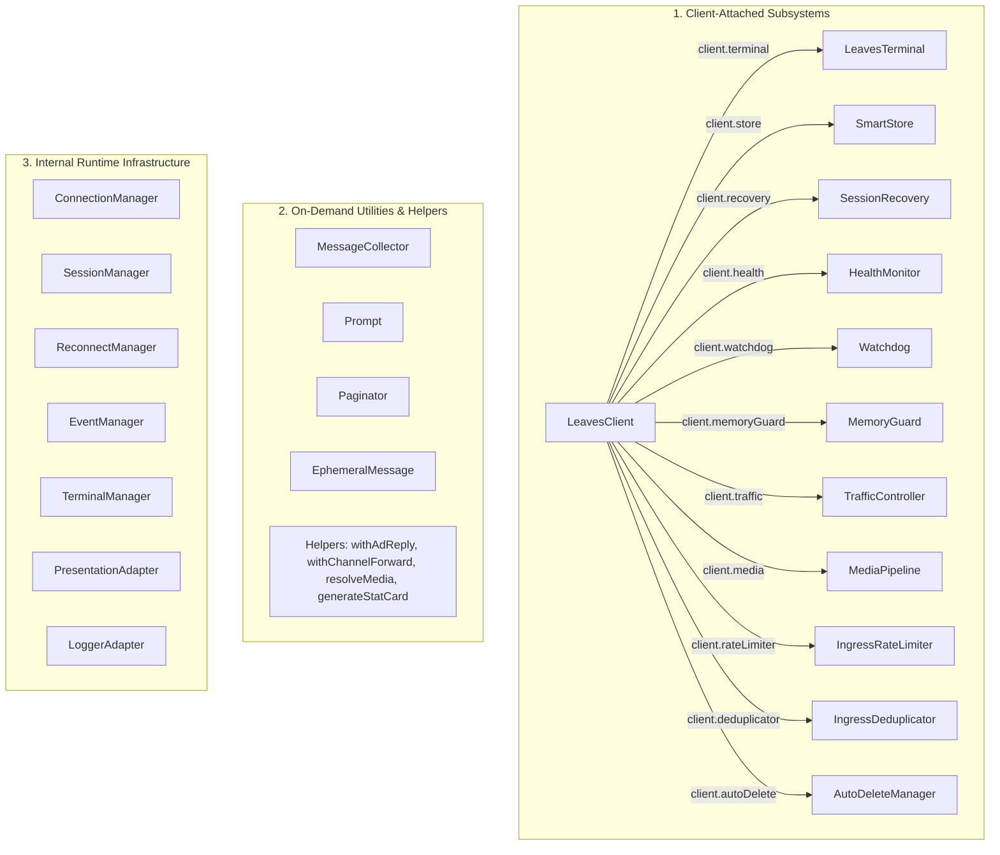

# Subsystems & Constants Reference

`leaves-guardian` features a modular architecture composed of specialized reliability engines, developer utilities, and infrastructure controllers. This document serves as the central API reference mapping public subsystem access paths on `LeavesClient`, standalone utility constructors, helper functions, and an exhaustive, untruncated catalog of all public constants, enums, states, and default options.

---

## 1. Subsystems Access Map & Architecture

`leaves-guardian` organizes its internal and external components into three functional tiers:



### Direct Access Property Map on LeavesClient

The following table summarizes all public subsystem accessors attached directly to any initialized `LeavesClient` instance:

| Property on `client` | Class Instance | Primary Function | Primary Public Methods |
| :--- | :--- | :--- | :--- |
| `client.terminal` | `LeavesTerminal` | Semantic terminal logging & privacy-aware console output. | `info()`, `success()`, `warn()`, `error()`, `debug()`, `mask()` |
| `client.store` | `SmartStore` | Atomic, in-memory JSON state & key-value store with TTL. | `get()`, `set()`, `delete()`, `has()`, `keys()`, `clear()`, `sweep()`, `namespace()` |
| `client.recovery` | `SessionRecovery` | Automated session health verification & snapshot rollback. | `checkSessionHealth()`, `createSnapshot()`, `restoreLatestValidSnapshot()`, `quarantineCurrentSession()`, `cleanEligibleAuthFiles()`, `clearBackups()` |
| `client.health` | `HealthMonitor` | Observability diagnostics, event loop lag, and memory tracking. | `start()`, `stop()`, `pause()`, `resume()`, `getStatus()`, `getMetrics()`, `getHistory()`, `registerProbe()` |
| `client.watchdog` | `Watchdog` | Socket liveness verification & zombie connection termination. | `start()`, `stop()`, `pause()`, `resume()`, `ping()`, `recordActivity()`, `getStatus()` |
| `client.memoryGuard` | `MemoryGuard` | Process memory observation & multi-stage heap mitigation. | `start()`, `stop()`, `pause()`, `resume()`, `getStatus()`, `getMetrics()`, `getHistory()`, `registerMitigationHook()` |
| `client.traffic` | `TrafficController` | Priority egress queue, FIFO fairness, backpressure & pacing. | `enqueue()`, `cancelTask()`, `pause()`, `resume()`, `drain()`, `getStats()`, `getQueueStatus()`, `getHistory()` |
| `client.media` | `MediaPipeline` | Media preparation, SSRF protection, MIME validation & temp spill. | `prepare()`, `abortJob()`, `abortAllJobs()`, `getStats()`, `cleanupTempDir()` |
| `client.rateLimiter` | `IngressRateLimiter` | Inbound request rate limiting with sliding window tracking. | `consume()`, `check()`, `resetKey()`, `resetAll()`, `getStats()` |
| `client.deduplicator` | `IngressDeduplicator` | Ingress duplicate message detection & suppression caching. | `isDuplicate()`, `register()`, `checkAndRegister()`, `clear()`, `getStats()` |
| `client.autoDelete` | `AutoDeleteManager` | Scheduled delayed message deletion with zero-rollback safety. | `register()`, `cancel()`, `cancelAll()`, `getTask()`, `getStats()` |

---

## 2. On-Demand Utilities & Helper Functions

### 2.1 On-Demand Interaction Utility Classes

These classes are instantiated per interactive workflow and operate over normalized `Message` objects:

```js
import {
  MessageCollector,
  Prompt,
  Paginator,
  EphemeralMessage
} from 'leaves-guardian';
```

| Class | Constructor Signature | Description |
| :--- | :--- | :--- |
| `MessageCollector` | `new MessageCollector(client, options)` | Collects incoming messages matching custom filter criteria within configurable time/count limits. |
| `Prompt` | `new Prompt(client, options)` | Guides users through single-step or multi-step question/answer interactive wizards. |
| `Paginator` | `new Paginator(client, options)` | Renders multi-page lists, catalogs, or menus with interactive navigation controls. |
| `EphemeralMessage` | `new EphemeralMessage(client, options)` | Configures and dispatches auto-expiring disappearing messages. |

### 2.2 Standalone Helper Functions

```js
import {
  withAdReply,
  withChannelForward,
  resolveMedia,
  generateStatCard
} from 'leaves-guardian';
```

| Function | Signature | Return Type | Description |
| :--- | :--- | :--- | :--- |
| `withAdReply` | `(contextInfo: object, options: object)` | `object` | Injects rich external link preview / ad reply metadata into Baileys `contextInfo`. |
| `withChannelForward` | `(contextInfo: object, options: object)` | `object` | Injects newsletter / official channel forward header metadata into `contextInfo`. |
| `resolveMedia` | `async (client: object, source: any, type: string, opts?: object)` | `Promise<any>` | Resolves media buffers, remote URLs, or local file paths for Baileys transmission. |
| `generateStatCard` | `(stats: object, options?: object)` | `string` | Formats an ASCII dashboard summary widget for health/metrics presentation. |

---

## 3. Internal Runtime Infrastructure

The following subsystems are instantiated and managed internally by `LeavesClient`. They are not intended for direct consumer instantiation, but their behavior can be configured via `LeavesClient` constructor options:

- **`ConnectionManager`**: Manages active Baileys socket creation, event relay, and QR/Pairing code coordination.
- **`SessionManager`**: Handles multi-file auth state persistence, folder creation, and creds validation.
- **`ReconnectManager`**: Manages exponential backoff and connection retry scheduling with jitter.
- **`EventManager`**: Coordinates internal emitter subscriptions and normalized event routing.
- **`TerminalManager`**: Central event bus for diagnostic logging, sink multiplexing, and presentation sanitization.
- **`PresentationAdapter`**: Bridges `LeavesClient` domain events to semantic terminal presentation logs.
- **`LoggerAdapter`**: Adapts standard Pino logger streams to `LeavesTerminal`.

---

## 4. Central Public Constants & Enums Dictionary

Below is the exhaustive, exact enumeration of all public constants, enums, state sets, error codes, and configuration default objects exported by `leaves-guardian`.

### 4.1 Core Client & Connection

#### `CLIENT_STATES`
```js
export const CLIENT_STATES = Object.freeze({
  IDLE: 'IDLE',
  INITIALIZING: 'INITIALIZING',
  AUTHENTICATING: 'AUTHENTICATING',
  CONNECTING: 'CONNECTING',
  OPEN: 'OPEN',
  READY: 'READY',
  DISCONNECTED: 'DISCONNECTED',
  RECONNECTING: 'RECONNECTING',
  LOGGED_OUT: 'LOGGED_OUT',
  SHUTDOWN: 'SHUTDOWN'
});
```

#### `RECONNECT_REASONS`
```js
export const RECONNECT_REASONS = Object.freeze({
  NETWORK_ERROR: 'NETWORK_ERROR',
  SERVER_UNAVAILABLE: 'SERVER_UNAVAILABLE',
  CONNECTION_CLOSED: 'CONNECTION_CLOSED',
  CONFLICT: 'CONFLICT',
  UNKNOWN_TRANSIENT: 'UNKNOWN_TRANSIENT'
});
```

---

### 4.2 Message Normalization & Abstraction

#### `MessageTypes`
```js
export const MessageTypes = Object.freeze({
  TEXT: 'text',
  IMAGE: 'image',
  VIDEO: 'video',
  AUDIO: 'audio',
  DOCUMENT: 'document',
  STICKER: 'sticker',
  LOCATION: 'location',
  CONTACT: 'contact',
  REACTION: 'reaction',
  POLL: 'poll',
  BUTTON: 'button',
  LIST: 'list',
  UNKNOWN: 'unknown'
});
```

---

### 4.3 SmartStore & Session Recovery

#### `CURRENT_STORE_VERSION`
```js
export const CURRENT_STORE_VERSION = 1;
```

#### `SESSION_STATUS`
```js
export const SESSION_STATUS = Object.freeze({
  FRESH_SESSION: 'FRESH_SESSION',
  HEALTHY: 'HEALTHY',
  CORRUPTED_ZERO_BYTE: 'CORRUPTED_ZERO_BYTE',
  CORRUPTED_SYNTAX_ERROR: 'CORRUPTED_SYNTAX_ERROR',
  CORRUPTED_SCHEMA_INVALID: 'CORRUPTED_SCHEMA_INVALID'
});
```

#### `SESSION_RECOVERY_CODES`
```js
export const SESSION_RECOVERY_CODES = Object.freeze({
  SESSION_CORRUPTED: 'SESSION_CORRUPTED',
  SNAPSHOT_CREATION_FAILED: 'SNAPSHOT_CREATION_FAILED',
  SNAPSHOT_INCONSISTENT: 'SNAPSHOT_INCONSISTENT',
  SNAPSHOT_CORRUPTED: 'SNAPSHOT_CORRUPTED',
  SESSION_UNRECOVERABLE: 'SESSION_UNRECOVERABLE',
  RESTORE_FAILED: 'RESTORE_FAILED',
  RESTORE_ACTIVATION_FAILED: 'RESTORE_ACTIVATION_FAILED',
  RECOVERY_BLOCKED_401: 'RECOVERY_BLOCKED_401',
  RECOVERY_BUSY: 'RECOVERY_BUSY',
  INVALID_PARAMETER: 'INVALID_PARAMETER'
});
```

---

### 4.4 Health Monitor & Diagnostics

#### `HEALTH_STATUS`
```js
export const HEALTH_STATUS = Object.freeze({
  HEALTHY: 'HEALTHY',
  DEGRADED: 'DEGRADED',
  CRITICAL: 'CRITICAL'
});
```

#### `PROBE_STATUS`
```js
export const PROBE_STATUS = Object.freeze({
  OK: 'OK',
  ERROR: 'ERROR',
  TIMEOUT: 'TIMEOUT'
});
```

#### `MONITOR_STATE`
```js
export const MONITOR_STATE = Object.freeze({
  STOPPED: 'STOPPED',
  RUNNING: 'RUNNING'
});
```

#### `HEALTH_ERROR_CODES`
```js
export const HEALTH_ERROR_CODES = Object.freeze({
  HEALTH_INVALID_THRESHOLD: 'HEALTH_INVALID_THRESHOLD',
  HEALTH_INVALID_OPTION: 'HEALTH_INVALID_OPTION',
  HEALTH_PROBE_ERROR: 'HEALTH_PROBE_ERROR'
});
```

#### `DEFAULT_THRESHOLDS`
```js
export const DEFAULT_THRESHOLDS = Object.freeze({
  eventLoopLagDegradedMs: 250,
  eventLoopLagCriticalMs: 1000,
  memoryHeapPercentDegraded: 80,
  memoryHeapPercentCritical: 95,
  disconnectedDurationDegradedMs: 15000,
  disconnectedDurationCriticalMs: 60000
});
```

---

### 4.5 Socket Watchdog & Memory Guard

#### `WATCHDOG_STATE`
```js
export const WATCHDOG_STATE = Object.freeze({
  STOPPED: 'STOPPED',
  RUNNING: 'RUNNING',
  PAUSED: 'PAUSED',
  TERMINATING: 'TERMINATING'
});
```

#### `WATCHDOG_ERROR_CODES`
```js
export const WATCHDOG_ERROR_CODES = Object.freeze({
  WATCHDOG_INVALID_OPTION: 'WATCHDOG_INVALID_OPTION',
  WATCHDOG_SOCKET_ERROR: 'WATCHDOG_SOCKET_ERROR'
});
```

#### `DEFAULT_WATCHDOG_OPTIONS`
```js
export const DEFAULT_WATCHDOG_OPTIONS = Object.freeze({
  enabled: true,
  checkIntervalMs: 15000,
  maxSilenceMs: 60000,
  pingTimeoutMs: 10000,
  maxMissedPings: 2
});
```

#### `MEMORY_GUARD_STATE`
```js
export const MEMORY_GUARD_STATE = Object.freeze({
  STOPPED: 'STOPPED',
  RUNNING: 'RUNNING',
  PAUSED: 'PAUSED'
});
```

#### `MEMORY_GUARD_LEVEL`
```js
export const MEMORY_GUARD_LEVEL = Object.freeze({
  NORMAL: 'NORMAL',
  WARNING: 'WARNING',
  CRITICAL: 'CRITICAL'
});
```

#### `MEMORY_ERROR_CODES`
```js
export const MEMORY_ERROR_CODES = Object.freeze({
  MEMORY_INVALID_OPTION: 'MEMORY_INVALID_OPTION',
  MEMORY_INVALID_THRESHOLD: 'MEMORY_INVALID_THRESHOLD',
  MEMORY_HOOK_ERROR: 'MEMORY_HOOK_ERROR'
});
```

#### `DEFAULT_MEMORY_GUARD_OPTIONS`
```js
export const DEFAULT_MEMORY_GUARD_OPTIONS = Object.freeze({
  enabled: true,
  checkIntervalMs: 30000,
  heapWarningBytes: 157286400,    // 150 MB
  heapCriticalBytes: 314572800,   // 300 MB
  rssWarningBytes: 262144000,     // 250 MB
  rssCriticalBytes: 524288000,    // 500 MB
  growthRateWarningPercent: 20,
  minimumGrowthBytes: 20971520,   // 20 MB
  sampleWindowSize: 5,
  autoMitigateOnCritical: true,
  allowManualGc: false,
  gcCooldownMs: 60000,
  hookTimeoutMs: 5000
});
```

#### `DEFAULT_MEMORY_GUARD_STATUS`
```js
export const DEFAULT_MEMORY_GUARD_STATUS = Object.freeze({
  state: 'STOPPED',
  level: 'NORMAL',
  timestamp: null,
  heapUsed: null,
  heapTotal: null,
  heapRatio: null
});
```

---

### 4.6 Traffic Controller & Ingress Controls

#### `TRAFFIC_STATE`
```js
export const TRAFFIC_STATE = Object.freeze({
  STOPPED: 'STOPPED',
  RUNNING: 'RUNNING',
  PAUSED: 'PAUSED'
});
```

#### `TRAFFIC_PRIORITY`
```js
export const TRAFFIC_PRIORITY = Object.freeze({
  HIGH: 'HIGH',
  NORMAL: 'NORMAL',
  LOW: 'LOW'
});
```

#### `TRAFFIC_TASK_STATE`
```js
export const TRAFFIC_TASK_STATE = Object.freeze({
  PENDING: 'PENDING',
  DISPATCHING: 'DISPATCHING',
  COMPLETED: 'COMPLETED',
  FAILED: 'FAILED',
  CANCELLED: 'CANCELLED'
});
```

#### `TRAFFIC_ERROR_CODES`
```js
export const TRAFFIC_ERROR_CODES = Object.freeze({
  TRAFFIC_QUEUE_FULL: 'TRAFFIC_QUEUE_FULL',
  TRAFFIC_TASK_CANCELLED: 'TRAFFIC_TASK_CANCELLED',
  TRAFFIC_CONTROLLER_STOPPED: 'TRAFFIC_CONTROLLER_STOPPED',
  TRAFFIC_INVALID_OPTION: 'TRAFFIC_INVALID_OPTION'
});
```

#### `DEFAULT_TRAFFIC_OPTIONS`
```js
export const DEFAULT_TRAFFIC_OPTIONS = Object.freeze({
  maxQueueSize: 1000,
  maxConcurrentDispatches: 1,
  minDispatchIntervalMs: 250,
  highWatermarkRatio: 0.8,
  lowWatermarkRatio: 0.2,
  maxConsecutiveHigh: 5,
  historyLimit: 100
});
```

#### `LIMITER_STATE`
```js
export const LIMITER_STATE = Object.freeze({
  RUNNING: 'RUNNING',
  STOPPED: 'STOPPED',
  DESTROYED: 'DESTROYED'
});
```

#### `RATE_LIMIT_ERROR_CODES`
```js
export const RATE_LIMIT_ERROR_CODES = Object.freeze({
  INVALID_OPTION: 'RATE_LIMIT_INVALID_OPTION',
  INTERNAL_ERROR: 'RATE_LIMIT_ERROR'
});
```

#### `DEFAULT_RATE_LIMITER_OPTIONS`
```js
export const DEFAULT_RATE_LIMITER_OPTIONS = Object.freeze({
  windowMs: 60000,          // 60 seconds
  maxRequests: 60,          // 60 requests per window
  penaltyDurationMs: 0,     // 0 = Disabled
  maxTrackedKeys: 10000,    // 10,000 tracked keys maximum
  cleanupIntervalMs: 60000, // 60 seconds housekeeping interval
  keyExtractor: defaultKeyExtractor,
  clock: () => Date.now()
});
```

#### `DEDUP_STATE`
```js
export const DEDUP_STATE = Object.freeze({
  RUNNING: 'RUNNING',
  STOPPED: 'STOPPED',
  DESTROYED: 'DESTROYED'
});
```

#### `DEDUP_ERROR_CODES`
```js
export const DEDUP_ERROR_CODES = Object.freeze({
  INVALID_OPTION: 'DEDUP_INVALID_OPTION',
  INVALID_KEY: 'DEDUP_INVALID_KEY',
  INTERNAL_ERROR: 'DEDUP_ERROR'
});
```

#### `DEFAULT_DEDUPLICATOR_OPTIONS`
```js
export const DEFAULT_DEDUPLICATOR_OPTIONS = Object.freeze({
  ttlMs: 300000,              // 5 minutes fixed TTL
  maxTrackedMessages: 10000,  // 10,000 tracked messages maximum
  cleanupIntervalMs: 60000,   // 60 seconds housekeeping interval
  keyExtractor: defaultIdentityExtractor,
  clock: () => Date.now()
});
```

---

### 4.7 Media Pipeline

#### `MEDIA_TYPE`
```js
export const MEDIA_TYPE = Object.freeze({
  IMAGE: 'image',
  VIDEO: 'video',
  AUDIO: 'audio',
  DOCUMENT: 'document',
  STICKER: 'sticker'
});
```

#### `MEDIA_REPRESENTATION`
```js
export const MEDIA_REPRESENTATION = Object.freeze({
  BUFFER: 'buffer',
  STREAM: 'stream',
  FILE: 'file'
});
```

#### `MEDIA_JOB_STATE`
```js
export const MEDIA_JOB_STATE = Object.freeze({
  PENDING: 'PENDING',
  RESOLVING: 'RESOLVING',
  DETECTING: 'DETECTING',
  VALIDATING: 'VALIDATING',
  TRANSFORMING: 'TRANSFORMING',
  FINALIZING: 'FINALIZING',
  COMPLETED: 'COMPLETED',
  FAILED: 'FAILED',
  CANCELLED: 'CANCELLED'
});
```

#### `MEDIA_ERROR_CODES`
```js
export const MEDIA_ERROR_CODES = Object.freeze({
  INVALID_SOURCE: 'MEDIA_INVALID_SOURCE',
  SIZE_EXCEEDED: 'MEDIA_SIZE_EXCEEDED',
  UNSUPPORTED_TYPE: 'MEDIA_UNSUPPORTED_TYPE',
  FETCH_FAILED: 'MEDIA_FETCH_FAILED',
  FETCH_TIMEOUT: 'MEDIA_FETCH_TIMEOUT',
  SSRF_BLOCKED: 'MEDIA_SSRF_BLOCKED',
  REDIRECT_LIMIT: 'MEDIA_REDIRECT_LIMIT',
  TRANSFORM_FAILED: 'MEDIA_TRANSFORM_FAILED',
  QUEUE_FULL: 'MEDIA_QUEUE_FULL',
  PIPELINE_ABORTED: 'MEDIA_PIPELINE_ABORTED',
  REPRESENTATION_UNAVAILABLE: 'MEDIA_REPRESENTATION_UNAVAILABLE',
  RESOURCE_RELEASED: 'MEDIA_RESOURCE_RELEASED'
});
```

#### `DEFAULT_MEDIA_OPTIONS`
```js
export const DEFAULT_MEDIA_OPTIONS = Object.freeze({
  maxInputBytes: 104857600,       // 100 MB
  maxOutputBytes: 104857600,      // 100 MB
  bufferThresholdBytes: 10485760, // 10 MB
  fetchTimeoutMs: 30000,          // 30 seconds
  maxRedirects: 5,
  tempDir: path.join(os.tmpdir(), 'leaves-media'),
  maxConcurrentJobs: 3,
  maxWaitingJobs: 50,
  allowPrivateIp: false
});
```

---

### 4.8 Terminal Presentation

#### `TERMINAL_LEVEL`
```js
export const TERMINAL_LEVEL = Object.freeze({
  DEBUG: 'DEBUG',
  INFO: 'INFO',
  WARN: 'WARN',
  ERROR: 'ERROR'
});
```

#### `LEVEL_WEIGHTS`
```js
export const LEVEL_WEIGHTS = Object.freeze({
  DEBUG: 10,
  INFO: 20,
  WARN: 30,
  ERROR: 40
});
```

#### `TERMINAL_DOMAIN`
```js
export const TERMINAL_DOMAIN = Object.freeze({
  CLIENT: 'CLIENT',
  MESSAGE: 'MESSAGE',
  RELIABILITY: 'RELIABILITY',
  TRAFFIC: 'TRAFFIC',
  MEDIA: 'MEDIA',
  APPLICATION: 'APPLICATION'
});
```

#### `TERMINAL_STATE`
```js
export const TERMINAL_STATE = Object.freeze({
  RUNNING: 'RUNNING',
  DESTROYED: 'DESTROYED'
});
```

#### `RENDERER_STATUS`
```js
export const RENDERER_STATUS = Object.freeze({
  HEALTHY: 'HEALTHY',
  DEGRADED: 'DEGRADED'
});
```

#### `TERMINAL_ERROR_CODES`
```js
export const TERMINAL_ERROR_CODES = Object.freeze({
  INVALID_OPTION: 'TERMINAL_INVALID_OPTION',
  INVALID_EVENT: 'TERMINAL_INVALID_EVENT',
  RENDERER_ERROR: 'TERMINAL_RENDERER_ERROR',
  INTERNAL_ERROR: 'TERMINAL_ERROR'
});
```

#### `DEFAULT_TERMINAL_OPTIONS`
```js
export const DEFAULT_TERMINAL_OPTIONS = Object.freeze({
  enabled: true,
  minLevel: 'INFO',
  privacyMasking: true,
  maxDispatchDepth: 3,
  clock: () => Date.now()
});
```

---

### 4.9 Developer Utilities

#### `COLLECTOR_END_REASONS`
```js
export const COLLECTOR_END_REASONS = Object.freeze({
  LIMIT: 'limit',
  TIME: 'time',
  IDLE: 'idle',
  USER: 'user',
  CANCELED: 'canceled',
  PROCESSED_LIMIT: 'processedLimit',
  SHUTDOWN: 'clientShutdown'
});
```

#### `PROMPT_STATES`
```js
export const PROMPT_STATES = Object.freeze({
  IDLE: 'IDLE',
  RUNNING: 'RUNNING',
  COMPLETED: 'COMPLETED',
  CANCELLED: 'CANCELLED',
  TIMEOUT: 'TIMEOUT',
  MAX_RETRIES: 'MAX_RETRIES',
  ERROR: 'ERROR',
  SHUTDOWN: 'SHUTDOWN'
});
```

#### `PAGINATOR_STATES`
```js
export const PAGINATOR_STATES = Object.freeze({
  IDLE: 'IDLE',
  RUNNING: 'RUNNING',
  STOPPED: 'STOPPED',
  TIMEOUT: 'TIMEOUT',
  SHUTDOWN: 'SHUTDOWN',
  ERROR: 'ERROR'
});
```

#### `PAGINATOR_ACTIONS`
```js
export const PAGINATOR_ACTIONS = Object.freeze({
  NEXT: 'NEXT',
  PREV: 'PREV',
  FIRST: 'FIRST',
  LAST: 'LAST',
  JUMP: 'JUMP',
  STOP: 'STOP'
});
```

#### `EPHEMERAL_DURATIONS`
```js
export const EPHEMERAL_DURATIONS = Object.freeze({
  ONE_DAY: 86400,          // 24 Hours
  ONE_WEEK: 604800,        // 7 Days
  THREE_MONTHS: 7776000,   // 90 Days
  DISABLED: 0              // Turn off ephemeral
});
```

#### `DEFAULT_EPHEMERAL_DURATION`
```js
export const DEFAULT_EPHEMERAL_DURATION = 604800; // 7 Days
```

#### `AUTODELETE_STATES`
```js
export const AUTODELETE_STATES = Object.freeze({
  PENDING: 'PENDING',
  EXECUTING: 'EXECUTING',
  COMPLETED: 'COMPLETED',
  CANCELLED: 'CANCELLED',
  FAILED: 'FAILED'
});
```
