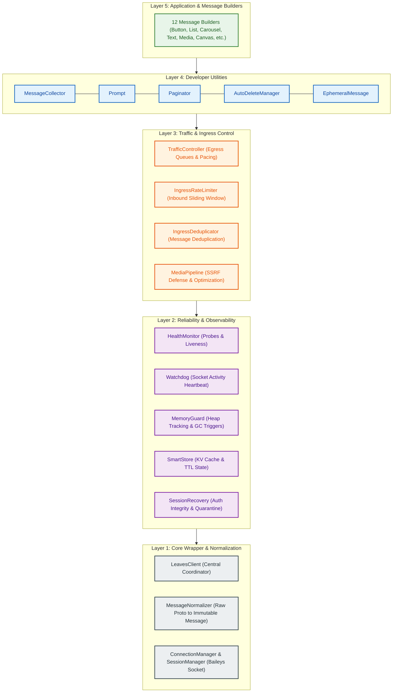
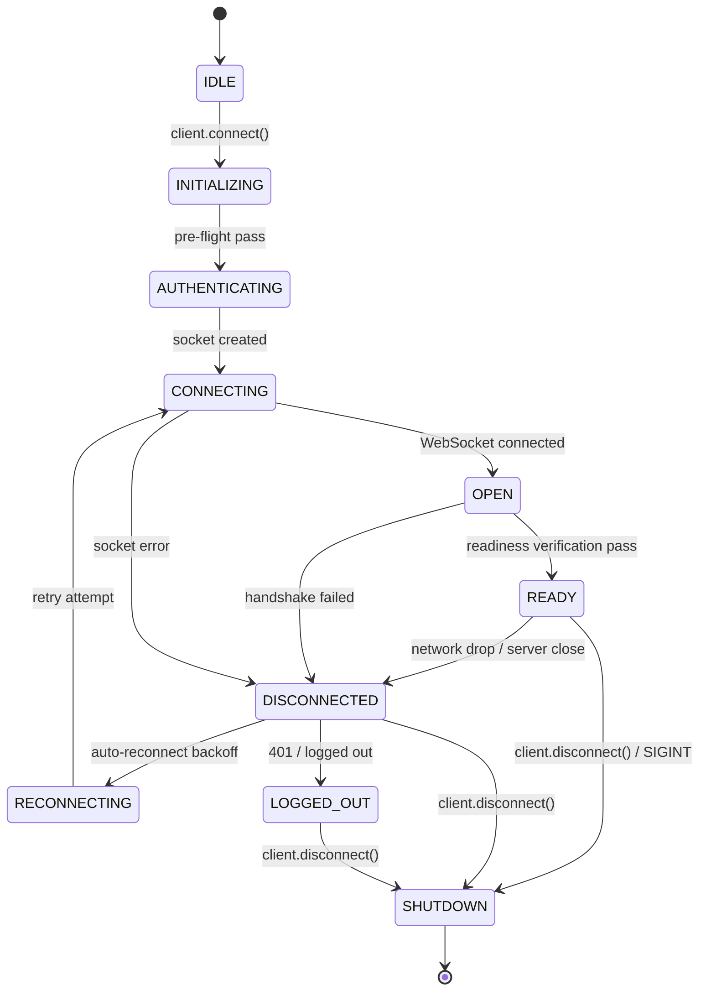

# Architecture & Lifecycle

Leaves Guardian is engineered around a modular, multi-tier architectural model that encapsulates the complexities of WhatsApp WebSocket communication, memory safety, ingress rate control, and outbound message dispatching.

---

## The 5-Layer Conceptual Model

The architecture of Leaves Guardian is organized into five conceptual layers. Each layer addresses a specific operational concern while maintaining loose coupling:

> **Note**: This hierarchy represents a **conceptual architecture model** designed to explain component responsibilities clearly. In practice, subsystems communicate reactively through event-driven mechanisms rather than a single rigid runtime pipeline.

---

## Layer Breakdown

### Layer 1: Core Wrapper & Message Normalization
* **`LeavesClient`**: The primary developer entrypoint and event emitter coordinating all subsystems.
* **`MessageNormalizer`**: Unwraps raw Baileys messages (extracting nested view-once, ephemeral, and edited structures) into unified, frozen `Message` objects.
* **`ConnectionManager`**: Manages underlying Baileys socket creation, event relay, and reconnect backoff algorithms.
* **`SessionManager`**: Manages multi-file auth credentials on disk, implementing atomic file writes and lockfile protection (`.session.lock`).

### Layer 2: Reliability & Observability Subsystems
* **`HealthMonitor`**: Continuously executes multi-probe health checks across memory, socket liveness, and error rates.
* **`Watchdog`**: Monitors raw socket read/write activity and ping/pong heartbeats to detect and resolve zombie socket deadlocks.
* **`MemoryGuard`**: Observes process heap allocations, categorizes memory pressure levels, and triggers mitigation hooks (such as store sweeps).
* **`SmartStore`**: High-resilience, in-memory key-value cache supporting namespaces, JSON serialization, and automatic TTL expiration.
* **`SessionRecovery`**: Inspects auth credential integrity on startup, auto-quarantining corrupted files and restoring from healthy snapshots.

### Layer 3: Traffic & Ingress Control Subsystems
* **`TrafficController` (Egress)**: Coordinates outbound message dispatching through **pacing and queued dispatch with priority-based scheduling and starvation prevention**.
  * Supports three priority queues: `HIGH`, `NORMAL`, and `LOW`.
  * Enforces minimum dispatch intervals (`minDispatchIntervalMs`) to pace outbound communication smoothly.
  * Employs starvation prevention (`maxConsecutiveHigh`) to ensure lower-priority messages are not permanently blocked.
* **`IngressRateLimiter` (Ingress)**: Applies **inbound sliding-window rate limiting** per sender JID/key to protect application handlers from burst flooding.
* **`IngressDeduplicator` (Ingress)**: Performs atomic, in-memory duplicate detection on incoming message IDs within a configurable TTL.
* **`MediaPipeline`**: Validates media inputs, enforces SSRF defenses against private IP ranges, and prepares media payloads safely.

### Layer 4: Developer Utilities
* **`MessageCollector`**: Collects incoming messages matching custom filter predicates with timeout and max-message limits.
* **`Prompt`**: Manages multi-step sequential interactions and input validations.
* **`Paginator`**: Manages structured, multi-page text and media lists with navigation actions.
* **`AutoDeleteManager`**: Schedules deterministic message deletions after a specified delay (`delayMs >= 0`).
* **`EphemeralMessage`**: Dispatches temporary messages with automatic timer cleanup.

### Layer 5: Message Builders
* **12 Fluent Builders**: Expressive class-based builders for `TextMessage`, `ButtonMessage`, `ListMessage`, `CarouselMessage`, `MediaMessage`, `StickerMessage`, `ProductMessage`, `PollMessage`, `AIRichMessage`, `CanvasMessage`, `EventMessage`, and `RichMessage`.

---

## Connection Lifecycle & State Machine

Leaves Guardian models socket states through an explicit state machine:

### The Invariant: `OPEN !== READY`

A critical design guarantee in Leaves Guardian is the strict distinction between `OPEN` and `READY`:

- **`OPEN`**: Indicates solely that the transport-level WebSocket connection to WhatsApp servers has opened.
- **`READY`**: **READY indicates that the client has completed its readiness checks and verified the authenticated account identity.**

The client verifies that `sock.user` or authenticated credential identities exist before emitting the `ready` event. This prevents application code from attempting to dispatch traffic prematurely.

---

## Graceful Shutdown & Subsystem Coordination

When stopping a client, calling `await client.disconnect()` initiates a coordinated shutdown process:

> **"Graceful shutdown coordinates subsystem cleanup, including active timers and scheduled tasks owned by the relevant subsystems."**

During shutdown, Leaves Guardian:
1. Stops active `MessageCollector`, `Prompt`, and `Paginator` sessions with a `CLIENT_SHUTDOWN` reason.
2. Clears pending timers in `AutoDeleteManager`.
3. Stops interval timers across `HealthMonitor`, `Watchdog`, and `MemoryGuard`.
4. Stops queues and cleanup timers in `TrafficController`, `IngressRateLimiter`, `IngressDeduplicator`, and `MediaPipeline`.
5. Detaches presentation sinks and closes the underlying WebSocket connection cleanly.
6. Transitions the state to `SHUTDOWN` and emits the `'shutdown'` event.

---

## Related Documentation

- **[Overview & Philosophy](/en/getting-started/overview)**: High-level overview and design goals.
- **[Quick Start Guide](/en/getting-started/quickstart)**: Set up and run a live client in minutes.
- **[Normalized Message Schema](/en/messaging/schema)**: Explore the immutable `Message` data contract.
