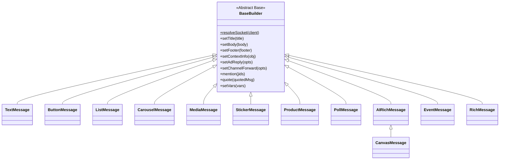
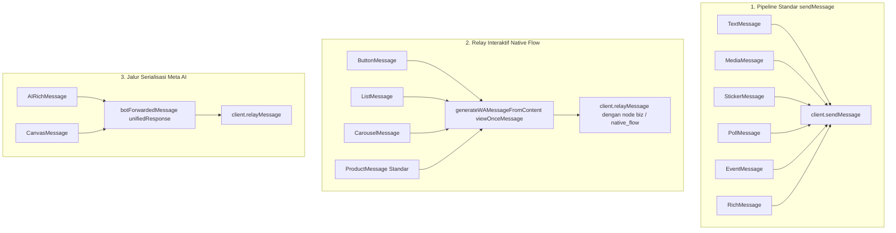

# Referensi API Message Builders

`leaves-guardian` menyediakan rangkaian terpadu berisi **12 Message Builders** berorientasi objek yang dibangun di atas abstract base class bersama (`BaseBuilder`). Dokumen ini berfungsi sebagai referensi API formal yang menetapkan hierarki inheritance, signature method, tipe parameter, nilai kembalian, aturan interpolasi template, perilaku serialisasi Baileys, serta error validasi umum.

---

## 1. Model Arsitektur & Pewarisan BaseBuilder

Seluruh 12 message builders mewarisi `BaseBuilder` (baik secara langsung maupun transitif, seperti `CanvasMessage` yang memperluas `AIRichMessage`).



### Kontrak Resolusi Socket

Setiap message builder membutuhkan instance socket atau client pada konstruktornya.

```js
import { ButtonMessage, LeavesClient } from 'leaves-guardian';

// Menggunakan LeavesClient
const client = new LeavesClient({ /* ... */ });
const btn = new ButtonMessage(client);

// BaseBuilder secara internal menyelesaikan socket aktif:
// BaseBuilder.resolveSocket(client)
```

- **`BaseBuilder.resolveSocket(client)`**: Menyelesaikan underlying socket dari input client/socket yang didukung (misalnya memanggil `client.getRawSocket()` jika instance `LeavesClient` diberikan, atau memakai objek socket langsung). Melempar `Error('Socket Baileys wajib di-pass ke constructor')` jika parameter bernilai nullish.

### Konvensi Fluent Chaining

Method mutasi pada builder umumnya mendukung fluent chaining dan mengembalikan instance builder (`this`) kecuali ditentukan lain (seperti factory method `CarouselMessage.prototype.newCard()`, static helper, atau method pengiriman asynchronous seperti `send()`).

---

## 2. Shared BaseBuilder Methods API

Method berikut diwarisi oleh seluruh builder konkret:

| Method | Signature | Parameter & Tipe | Nilai Kembalian | Deskripsi |
| :--- | :--- | :--- | :--- | :--- |
| `setTitle` | `(title: string)` | `title`: `string` | `this` | Menetapkan string judul/header utama. |
| `setBody` | `(body: string)` | `body`: `string` | `this` | Menetapkan teks badan utama pesan. |
| `setFooter` | `(footer: string)` | `footer`: `string` | `this` | Menetapkan teks footer kecil di bagian bawah. |
| `setContextInfo` | `(obj: object)` | `obj`: `Record<string, any>` | `this` | Menggabungkan field `contextInfo` Baileys kustom. |
| `setAdReply` | `(opts: object)` | `opts`: `AdReplyOptions` | `this` | Menempelkan metadata pratinjau tautan interaktif (`externalAdReply`). |
| `setChannelForward` | `(opts: object)` | `opts`: `ChannelForwardOptions` | `this` | Mengonfigurasi metadata header terusan saluran/newsletter. |
| `mention` | `(jids: string \| string[])` | `jids`: `string \| string[]` | `this` | Menambahkan JID ke dalam `mentionedJid` context info. |
| `quote` | `(quotedMsg: object)` | `quotedMsg`: `WAMessage \| object` | `this` | Menempelkan pesan yang dikutip untuk konteks balasan (quote). |
| `setVars` | `(vars: object)` | `vars`: `Record<string, any>` | `this` | Menetapkan kamus variabel untuk interpolasi template `{{namaVar}}`. |

### Mesin Interpolasi Template

Seluruh teks yang dirender melalui `BaseBuilder` mendukung placeholder `{{variable}}`. Ketika `setVars({ nama: 'Rafa' })` disetel:
- Placeholder `{{nama}}` digantikan dengan representasi string dari `Rafa`.
- Placeholder yang tidak memiliki pasangan tetap dibiarkan sebagai teks literal (misalnya `{{unknown}}` tetap menjadi `{{unknown}}`).
- Interpolasi dieksekusi secara lazy saat `build()` atau `send()` dipanggil.

---

## 3. Katalog Spesifikasi Builder

### 3.1 TextMessage

Builder pesan teks biasa dengan kontrol link preview dan metadata konteks.

- **Impor:** `import { TextMessage } from 'leaves-guardian';`
- **Konstruktor:** `new TextMessage(client)`

| Method | Signature | Nilai Kembalian | Deskripsi |
| :--- | :--- | :--- | :--- |
| `disableLinkPreview` | `()` | `this` | Menonaktifkan pratinjau URL otomatis (`linkPreview = false`). |
| `build` | `()` | `object` | Mengembalikan objek Baileys `{ text, mentions, linkPreview, contextInfo }`. |
| `send` | `async (jid: string, options?: object)` | `Promise<WAMessage>` | Memvalidasi isi teks dan mengirim pesan via `client.sendMessage`. |

---

### 3.2 ButtonMessage

Pesan tombol interaktif dengan quick reply, tautan URL CTA, tombol salin teks CTA, banner promosi, dan header media opsional.

- **Impor:** `import { ButtonMessage } from 'leaves-guardian';`
- **Konstruktor:** `new ButtonMessage(client)`

| Method | Signature | Nilai Kembalian | Deskripsi |
| :--- | :--- | :--- | :--- |
| `addReply` | `(displayText: string, id: string)` | `this` | Menambahkan tombol aksi balasan cepat (`quick_reply`). |
| `addUrl` | `(displayText: string, url: string)` | `this` | Menambahkan tombol tautan web eksternal (`cta_url`). |
| `addCopy` | `(displayText: string, copyCode: string)` | `this` | Menambahkan tombol salin kode clipboard 1-ketukan (`cta_copy`). |
| `addLimitedOffer` | `(displayText: string, opts?: object)` | `this` | Menambahkan tombol penawaran terbatas dengan badge/countdown. |
| `setBanner` | `(bannerText: string, opts?: object)` | `this` | Alias untuk mengatur teks banner promosi. |
| `setImage` | `(source: string \| Buffer)` | `this` | Menempelkan header gambar (URL, path file, atau Buffer). |
| `setVideo` | `(source: string \| Buffer)` | `this` | Menempelkan header video. |
| `setDocument` | `(source: string \| Buffer, options?: object)` | `this` | Menempelkan header dokumen dengan opsi `fileName` dan `mimetype`. |
| `build` | `async ()` | `Promise<object>` | Menyiapkan lampiran media dan membangun payload interaktif Native Flow. |
| `send` | `async (jid: string, options?: object)` | `Promise<WAMessage>` | Mengirim pesan Native Flow terbungkus `viewOnceMessage` dengan node `biz`. |

---

### 3.3 ListMessage

Menu pilihan interaktif yang mendukung pembagian seksi berkategori dan baris pilihan tunggal.

- **Impor:** `import { ListMessage } from 'leaves-guardian';`
- **Konstruktor:** `new ListMessage(client)`

| Method | Signature | Nilai Kembalian | Deskripsi |
| :--- | :--- | :--- | :--- |
| `setButtonText` | `(text: string)` | `this` | Mengatur label tombol pembuka menu (default: `'Pilih'`). |
| `addSection` | `(sectionTitle: string, rows: ListRow[])` | `this` | Menambahkan seksi berisi baris `{ id, title, description?, header? }`. |
| `findRow` | `(id: string)` | `ListRow` | Mencari baris berdasarkan ID; melempar `ItemNotFoundError` jika tidak ada. |
| `build` | `async ()` | `Promise<object>` | Memvalidasi seksi dan merakit payload Native Flow `single_select`. |
| `send` | `async (jid: string, options?: object)` | `Promise<WAMessage>` | Mengirim pesan interaktif `single_select` dengan node `biz`. |

---

### 3.4 CarouselMessage

Slider kartu geser horizontal multi-kartu. Setiap kartu memiliki media header, judul, badan teks, footer, dan tombolnya sendiri.

- **Impor:** `import { CarouselMessage } from 'leaves-guardian';`
- **Konstruktor:** `new CarouselMessage(client)`

| Method | Signature | Nilai Kembalian | Deskripsi |
| :--- | :--- | :--- | :--- |
| `addCard` | `(cardOrFn: ((card: CarouselCard) => void) \| CarouselCard)` | `this` | Menambahkan kartu lewat callback fungsi builder atau instance kartu. |
| `newCard` | `(id: string)` | `CarouselCard` | Membuat dan mengembalikan instance `CarouselCard` baru terdaftar pada `id`. |
| `build` | `async ()` | `Promise<object>` | Memvalidasi minimal 2 kartu, mengunggah media kartu, dan merakit payload. |
| `send` | `async (jid: string, options?: object)` | `Promise<WAMessage>` | Mengirim pesan carousel interaktif dengan node `biz`. |

#### Method CarouselCard

| Method | Signature | Nilai Kembalian | Deskripsi |
| :--- | :--- | :--- | :--- |
| `setTitle` | `(title: string)` | `this` | Mengatur judul kartu. |
| `setBody` | `(body: string)` | `this` | Mengatur badan teks kartu. |
| `setFooter` | `(footer: string)` | `this` | Mengatur footer kartu. |
| `setImage` | `(source: string \| Buffer)` | `this` | Mengatur gambar kartu. |
| `addReply` | `(displayText: string, id: string)` | `this` | Menambahkan tombol quick reply pada kartu. |
| `addUrl` | `(displayText: string, url: string)` | `this` | Menambahkan tombol URL pada kartu. |
| `addCopy` | `(displayText: string, copyCode: string)` | `this` | Menambahkan tombol salin kode pada kartu. |

---

### 3.5 MediaMessage

Builder media terpadu untuk payload gambar, video, dokumen, audio, dan stiker.

- **Impor:** `import { MediaMessage } from 'leaves-guardian';`
- **Konstruktor:** `new MediaMessage(client, type = 'image')`

| Method | Signature | Nilai Kembalian | Deskripsi |
| :--- | :--- | :--- | :--- |
| `setType` | `(type: 'image' \| 'video' \| 'document' \| 'sticker' \| 'audio')` | `this` | Memperbarui tipe media. Divalidasi terhadap tipe yang didukung. |
| `setSource` | `(source: string \| Buffer)` | `this` | Menyetel sumber media (URL HTTP, path file lokal, atau Buffer). |
| `setFileName` | `(name: string)` | `this` | Menyetel nama file dokumen (wajib untuk `type === 'document'`). |
| `setMimetype` | `(mimetype: string)` | `this` | Menyetel MIME type eksplisit (cth: `application/pdf`, `audio/ogg`). |
| `asVoiceNote` | `()` | `this` | Menyetel `ptt = true` (hanya berlaku untuk `type === 'audio'`). |
| `asGif` | `()` | `this` | Menyetel `gifPlayback = true` (hanya berlaku untuk `type === 'video'`). |
| `build` | `async ()` | `Promise<object>` | Menyelesaikan sumber media dan merakit payload pesan media Baileys. |
| `send` | `async (jid: string, options?: object)` | `Promise<WAMessage>` | Mengirim pesan media via `client.sendMessage`. |

---

### 3.6 StickerMessage

Generator stiker WebP dengan konversi otomatis canvas 512x512 dan penyematan metadata EXIF pack & author.

- **Impor:** `import { StickerMessage } from 'leaves-guardian';`
- **Konstruktor:** `new StickerMessage(client)`

| Method / Helper | Signature | Nilai Kembalian | Deskripsi |
| :--- | :--- | :--- | :--- |
| `setSource` | `(source: string \| Buffer)` | `this` | Menyetel sumber stiker (URL, path file, Buffer, base64). |
| `setPackName` | `(name: string)` | `this` | Menyetel nama pack stiker pada EXIF (default: `'Leaves Guardian'`). |
| `setAuthor` | `(author: string)` | `this` | Menyetel pembuat/author stiker pada EXIF (default: `'Royal Engine Studio'`). |
| `setCategories` | `(categories: string \| string[])` | `this` | Menyetel kategori emoji stiker (default: `['🍃']`). |
| `StickerMessage.createExif` | `static (packName?, author?, categories?)` | `Buffer` | Membangun chunk biner metadata EXIF resmi WhatsApp. |
| `StickerMessage.attachExifToWebp` | `static (webpBuffer: Buffer, exifBuffer: Buffer)` | `Buffer` | Menyisipkan chunk EXIF ke dalam kontainer WebP RIFF/VP8X. |
| `StickerMessage.convertToWebp` | `static async (buffer: Buffer)` | `Promise<Buffer>` | Mengonversi sembarang buffer gambar ke WebP 512x512 via canvas. |
| `build` | `async ()` | `Promise<object>` | Menyelesaikan sumber, mengubah ke WebP, menyematkan EXIF, return `{ sticker, ... }`. |
| `send` | `async (jid: string, options?: object)` | `Promise<WAMessage>` | Mengirim stiker via `client.sendMessage`. |

---

### 3.7 ProductMessage

Builder kartu produk WhatsApp universal dengan pemformatan harga dan integrasi opsional Meta Business Catalog.

- **Impor:** `import { ProductMessage } from 'leaves-guardian';`
- **Konstruktor:** `new ProductMessage(client)`

| Method / Helper | Signature | Nilai Kembalian | Deskripsi |
| :--- | :--- | :--- | :--- |
| `setDescription` | `(desc: string)` | `this` | Menyetel deskripsi detail produk. |
| `setPrice` | `(amount: number, currencyCode = 'IDR')` | `this` | Menyetel nominal harga angka dan kode mata uang ISO. |
| `setImage` | `(source: string \| Buffer)` | `this` | Menyetel gambar pratinjau produk. |
| `setRetailerId` | `(id: string)` | `this` | Menyetel ID/SKU unik produk untuk pelacakan pesanan. |
| `setUrl` | `(url: string)` | `this` | Menyetel tautan web halaman toko / produk. |
| `setButtonText` | `(text: string)` | `this` | Menyetel label tombol aksi (default: `'Beli Sekarang'`). |
| `setSeller` | `(jid: string)` | `this` | Menyetel WhatsApp JID penjual/seller. |
| `useBusinessCatalog` | `(value = true)` | `this` | Mengaktifkan skema katalog resmi WhatsApp Business. |
| `ProductMessage.formatPrice` | `static (amount: number, currency = 'IDR')` | `string` | Memformat harga teralokasi (cth: `'Rp 15.000'`). |
| `build` | `async ()` | `Promise<object>` | Menyiapkan media dan merakit payload katalog atau produk interaktif. |
| `send` | `async (jid: string, options?: object)` | `Promise<WAMessage>` | Mengirim pesan produk dengan pembungkusan protokol yang sesuai. |

---

### 3.8 PollMessage

Builder pembuatan polling/voting resmi WhatsApp.

- **Impor:** `import { PollMessage } from 'leaves-guardian';`
- **Konstruktor:** `new PollMessage(client)`

| Method | Signature | Nilai Kembalian | Deskripsi |
| :--- | :--- | :--- | :--- |
| `setQuestion` / `setTitle` | `(question: string)` | `this` | Menyetel topik/pertanyaan polling. |
| `addOption` | `(name: string)` | `this` | Menambahkan opsi pilihan polling (maksimal 12 opsi). |
| `setSelectableCount` | `(count: number)` | `this` | Menyetel jumlah pilihan yang diizinkan (`1` = single-select, `0` = unlimited). |
| `allowMultipleAnswers` | `(allow = true)` | `this` | Helper kenyamanan (`true` &rarr; `selectableCount = 0`, `false` &rarr; `1`). |
| `build` | `()` | `object` | Memvalidasi opsi (min 2, max 12) dan merakit payload `poll`. |
| `send` | `async (jid: string, options?: object)` | `Promise<WAMessage>` | Mengirim polling via `client.sendMessage`. |

---

### 3.9 AIRichMessage

Builder layout Meta AI Rich Response yang mendukung hyperlink markdown, syntax highlighting kode, chip saran interaktif, sitasi sumber, formula LaTeX, dan widget HTML interaktif.

- **Impor:** `import { AIRichMessage } from 'leaves-guardian';`
- **Konstruktor:** `new AIRichMessage(client)`

| Method / Helper | Signature | Nilai Kembalian | Deskripsi |
| :--- | :--- | :--- | :--- |
| `addText` | `(text: string, options?: object)` | `this` | Menambahkan teks markdown dengan dukungan tautan `[link](url)` dan formula LaTeX. |
| `addCode` | `(language: string, code: string)` | `this` | Menambahkan blok kode dengan penyorotan sintaksis. |
| `addTable` | `(table: any[][])` | `this` | Menambahkan tabel terstruktur GenAI dengan baris header. |
| `addChip` | `(label: string, query?: string)` | `this` | Menambahkan chip saran prompt interaktif tunggal. |
| `addSuggest` | `(suggestions: string[])` | `this` | Menambahkan daftar chip rekomendasi/saran di bawah pesan. |
| `addCitation` | `(index: number, url: string, title?: string)` | `this` | Menempelkan tautan referensi sitasi sumber. |
| `addTip` | `(text: string)` | `this` | Menambahkan catatan tip kecil di bawah pesan. |
| `addHtml` | `(htmlPayload: string, options?: object)` | `this` | Menambahkan payload mini-app / canvas HTML interaktif. |
| `AIRichMessage.generateVerificationMetadata` | `static ()` | `object` | Menghasilkan struktur bukti verifikasi Meta AI. |
| `build` | `(jid: string, options?: object)` | `object` | Merakit `botForwardedMessage` dengan `unifiedResponse` base64. |
| `send` | `async (jid: string, options?: object)` | `Promise<WAMessage>` | Mengirim respons kaya menggunakan jalur serialisasi khusus Meta AI. |

---

### 3.10 CanvasMessage

Pelari mini-app / game HTML5 interaktif di WhatsApp. Memperluas `AIRichMessage`.

- **Impor:** `import { CanvasMessage } from 'leaves-guardian';`
- **Konstruktor:** `new CanvasMessage(client)`

| Method | Signature | Nilai Kembalian | Deskripsi |
| :--- | :--- | :--- | :--- |
| `setHtml` | `(html: string, options?: object)` | `this` | Menyetel kode HTML/CSS/JS lengkap serta domain whitelist `trustedSources` opsional. |
| `build` | `(jid: string, options?: object)` | `object` | Membungkus HTML ke dalam `GenAIaeacdsnwHtmlPrimitive` dan merakit payload. |
| `send` | `async (jid: string, options?: object)` | `Promise<WAMessage>` | Mengirim canvas mini-app melalui pipeline pengiriman `AIRichMessage`. |

---

### 3.11 EventMessage

Builder undangan acara resmi WhatsApp Group Event.

- **Impor:** `import { EventMessage } from 'leaves-guardian';`
- **Konstruktor:** `new EventMessage(client)`

| Method | Signature | Nilai Kembalian | Deskripsi |
| :--- | :--- | :--- | :--- |
| `setName` | `(name: string)` | `this` | Menyetel judul resmi acara/event. |
| `setDescription` | `(desc: string)` | `this` | Menyetel deskripsi detail acara. |
| `setStartTime` | `(dateOrTs: Date \| number)` | `this` | Menyetel waktu mulai acara. |
| `setEndTime` | `(dateOrTs: Date \| number)` | `this` | Menyetel waktu selesai acara (opsional). |
| `setLocation` | `(locationName: string)` | `this` | Menyetel nama lokasi/tempat acara fisik. |
| `setCallLink` | `(url: string)` | `this` | Menyetel URL panggilan/rapat WhatsApp. |
| `setCanceled` | `(isCanceled = true)` | `this` | Menyetel status pembatalan acara. |
| `build` | `()` | `object` | Menghasilkan payload `event` Baileys dengan `messageSecret` acak. |
| `send` | `async (jid: string, options?: object)` | `Promise<WAMessage>` | Mengirim pesan acara via `client.sendMessage`. |

---

### 3.12 RichMessage

Builder teks monospace terstruktur yang mendukung tabel (ASCII / daftar bullet), blok kode, dan tip kutipan tanpa ketergantungan media eksternal.

- **Impor:** `import { RichMessage } from 'leaves-guardian';`
- **Konstruktor:** `new RichMessage(client)`

| Method / Helper | Signature | Nilai Kembalian | Deskripsi |
| :--- | :--- | :--- | :--- |
| `addHeader` | `(text: string)` | `this` | Menyetel judul header utama (alias untuk `setTitle`). |
| `addText` | `(text: string)` | `this` | Menambahkan paragraf teks standar. |
| `addTable` | `(table: any[][], options?: object)` | `this` | Menambahkan tabel terstruktur dengan gaya `'list'` (default) atau `'table'` (ASCII). |
| `addCode` | `(language: string, code: string)` | `this` | Menambahkan blok kode berpagar (`\`\`\``). |
| `addTip` | `(text: string)` | `this` | Menambahkan kutipan catatan tip (`> 💡 _text_`). |
| `RichMessage.formatTableList` | `static (tableData: any[][])` | `string` | Memformat array tabel menjadi daftar kartu bullet yang ramah layar ponsel. |
| `RichMessage.formatTableAscii` | `static (tableData: any[][])` | `string` | Memformat array tabel menjadi grid kotak ASCII yang sejajar. |
| `formatMessage` | `()` | `string` | Merakit seluruh elemen menjadi string terformat final. |
| `build` | `()` | `object` | Mengembalikan objek `{ text, contextInfo }`. |
| `send` | `async (jid: string, options?: object)` | `Promise<WAMessage>` | Mengirim teks kaya via `client.sendMessage`. |

---

## 4. Mekanisme Serialisasi & Pengiriman

### `.build()` vs `.send(jid, options)`

Setiap message builder memisahkan antara kompilasi struktural dan pengiriman jaringan:
1. **`build()`**: Validasi dan perakitan objek secara synchronous atau asynchronous murni. Menyiapkan lampiran media (jika ada) dan menghasilkan struktur payload persis seperti yang diharapkan Baileys.
2. **`send(jid, options)`**: Mengeksekusi `build()`, kemudian mentransmisikan pesan melalui socket aktif menggunakan pipeline pengiriman yang sesuai.

### Taksonomi Pengiriman

`leaves-guardian` merutekan pesan melalui tiga pipeline pengiriman berbeda:



> [!NOTE]
> **Catatan Detail Implementasi:**
> Builder pada pipeline Meta AI (`AIRichMessage` dan `CanvasMessage`) secara internal menggunakan jalur serialisasi khusus yang kompatibel dengan Meta AI untuk memastikan pesan ter-render andal di berbagai versi aplikasi WhatsApp. Format amplop protokol internal tersebut merupakan detail implementasi dan tidak perlu disusun secara manual oleh konsumen library.

---

## 5. Validasi Umum & Error Penggunaan

Rangkaian builder melempar error deskriptif ketika prasyarat atau batasan terlanggar:

| Kelas Error | Skenario Pemicu Umum | Rekomendasi Penanganan |
| :--- | :--- | :--- |
| `ContentValidationError` | Body kosong pada `TextMessage`, `< 2` opsi pada `PollMessage`, `< 2` kartu pada `CarouselMessage`, `fileName` dokumen tidak ada, harga bernilai negatif, atau tombol kosong. | Validasi parameter input sebelum builder dikompilasi. |
| `DuplicateIdError` | Menambahkan ID baris list atau ID kartu carousel yang sudah ada sebelumnya pada instance builder. | Pastikan keunikan ID di seluruh baris atau kartu. |
| `ItemNotFoundError` | Mencari ID baris yang tidak ada lewat `ListMessage.prototype.findRow(id)`. | Pastikan keberadaan ID item sebelum melakukan pencarian. |
| `TypeError` | Memberikan tipe data non-string atau tipe parameter tidak valid ke method yang mengharapkan primitif tertentu (cth: `setName`, `addText`, `setHtml`). | Terapkan pengecekan tipe data runtime / TypeScript yang disiplin. |
