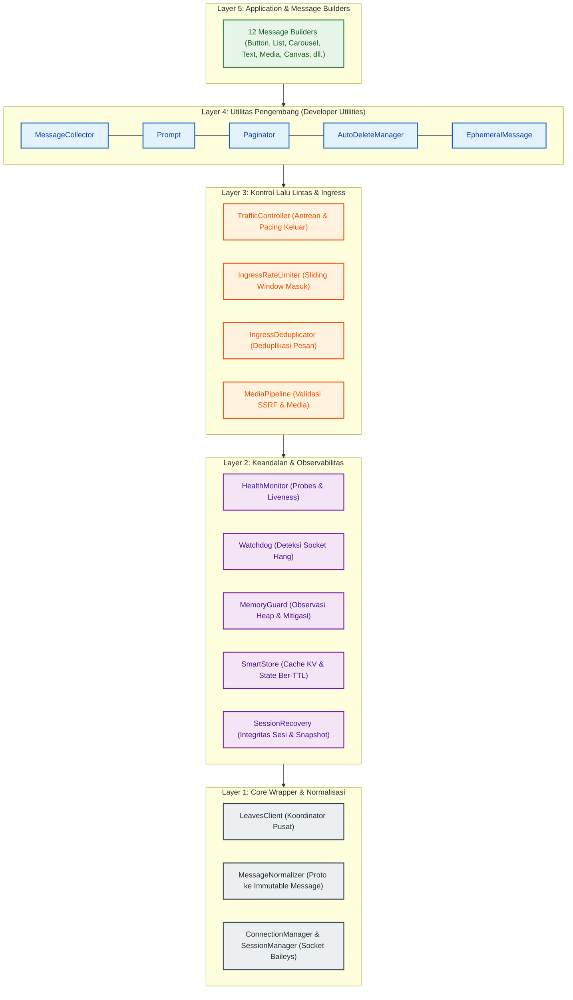
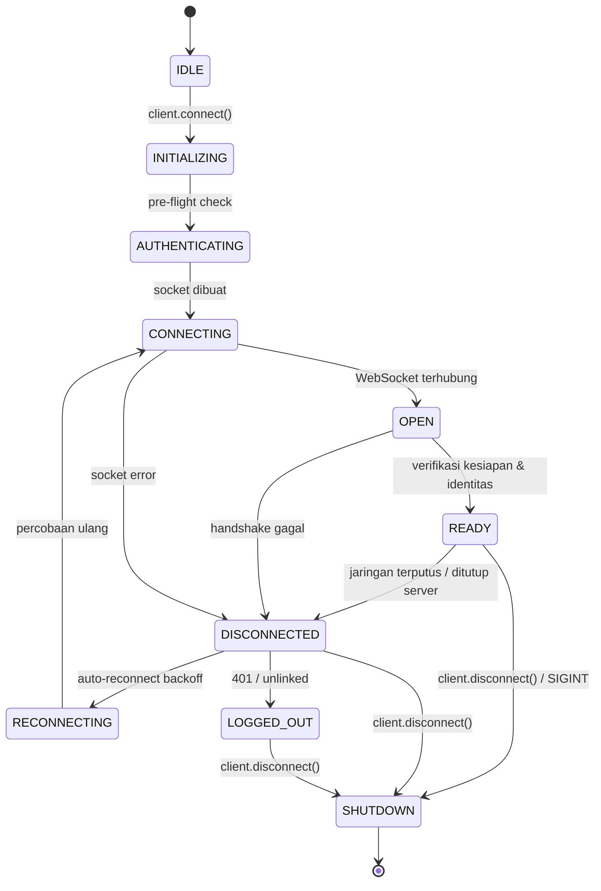

# Arsitektur & Siklus Hidup

Leaves Guardian dibangun dengan model arsitektur bertingkat yang memisahkan kompleksitas protokol WebSocket WhatsApp, keamanan memori, kontrol laju pesan masuk, dan antrean pengiriman pesan keluar.

---

## Model Konseptual 5-Layer

Arsitektur internal Leaves Guardian dikelompokkan ke dalam 5 layer konseptual untuk memastikan isolasi tanggung jawab yang jelas:

> **Catatan**: Diagram ini mempresentasikan **model arsitektur konseptual** untuk memudahkan pemahaman. Secara runtime, subsistem bekerja secara reaktif berbasis event dan tidak terikat dalam satu pipeline sekuensial yang kaku.

---

## Penjelasan Per Layer

### Layer 1: Core Wrapper & Normalisasi Pesan
* **`LeavesClient`**: Titik masuk utama developer dan event emitter terpusat.
* **`MessageNormalizer`**: Mengurai pesan mentah Baileys (view-once, pesan sementara, hasil editan) menjadi objek `Message` yang seragam dan dibekukan (*frozen*).
* **`ConnectionManager`**: Mengelola siklus hidup socket Baileys, propagasi event, dan algoritma reconnect backoff.
* **`SessionManager`**: Mengelola kredensial autentikasi multi-file di disk dengan penulisan atomik dan proteksi lockfile (`.session.lock`).

### Layer 2: Keandalan & Observabilitas
* **`HealthMonitor`**: Menjalankan pemeriksaan berkala terhadap memori, soket, dan tingkat kesalahan (*error rate*).
* **`Watchdog`**: Memantau aktivitas baca/tulis socket dan heartbeat ping/pong untuk mendeteksi *deadlock* atau koneksi zombie.
* **`MemoryGuard`**: Mengamati alokasi heap Node.js dan memicu hook mitigasi otomatis saat ambang batas terlampaui.
* **`SmartStore`**: Penyimpanan key-value in-memory berkinerja tinggi dengan namespace, serialisasi JSON, dan TTL otomatis.
* **`SessionRecovery`**: Memeriksa integritas file sesi saat inisialisasi, mengisolasi file rusak (*quarantine*), dan memulihkan dari snapshot sehat.

### Layer 3: Kontrol Lalu Lintas & Ingress
* **`TrafficController` (Egress)**: Mengatur pengiriman pesan keluar melalui **pacing and queued dispatch with priority-based scheduling and starvation prevention**.
  * Menyediakan 3 tingkatan antrean: `HIGH`, `NORMAL`, dan `LOW`.
  * Menerapkan interval pengiriman minimum (`minDispatchIntervalMs`) agar pesan terkirim secara ritmis dan stabil.
  * Menerapkan proteksi kelaparan antrean (*starvation prevention*) agar pesan berprioritas lebih rendah tetap terkirim secara adil.
* **`IngressRateLimiter` (Ingress)**: Menerapkan **pembatasan laju pesan masuk berbasis sliding-window** per pengirim (JID) untuk mencegah banjir pesan (*flooding*).
* **`IngressDeduplicator` (Ingress)**: Melakukan deteksi pesan duplikat secara atomik dan in-memory berdasarkan ID pesan dalam rentang waktu TTL tertentu.
* **`MediaPipeline`**: Memvalidasi sumber media, menangkal serangan SSRF ke IP privat, dan memproses file media secara aman.

### Layer 4: Utilitas Pengembang (Developer Utilities)
* **`MessageCollector`**: Menangkap pesan masuk yang cocok dengan filter kustom dengan batas waktu (*timeout*) dan batas jumlah pesan.
* **`Prompt`**: Mengelola alur interaksi tanya-jawab berurutan (*multi-step*) dengan validasi input.
* **`Paginator`**: Mengelola navigasi halaman interaktif untuk pesan teks atau media panjang.
* **`AutoDeleteManager`**: Menjadwalkan penghapusan pesan secara otomatis setelah jeda waktu tertentu (`delayMs >= 0`).
* **`EphemeralMessage`**: Mengirim pesan sementara dengan pembersihan timer otomatis.

### Layer 5: Message Builders
* **12 Fluent Builders**: Class builder ekspresif untuk `TextMessage`, `ButtonMessage`, `ListMessage`, `CarouselMessage`, `MediaMessage`, `StickerMessage`, `ProductMessage`, `PollMessage`, `AIRichMessage`, `CanvasMessage`, `EventMessage`, dan `RichMessage`.

---

## Siklus Hidup Koneksi (Connection Lifecycle)

Leaves Guardian mengelola status soket melalui *state machine* yang terstruktur:

### Jaminan Invarian: `OPEN !== READY`

Salah satu jaminan arsitektur terpenting adalah pemisahan antara `OPEN` dan `READY`:

- **`OPEN`**: Menunjukkan bahwa koneksi fisik WebSocket tingkat transport ke server WhatsApp telah terbuka.
- **`READY`**: **READY indicates that the client has completed its readiness checks and verified the authenticated account identity.**

Client memastikan objek identitas pengguna (`sock.user` atau auth credentials) telah terverifikasi sebelum memancarkan event `ready`.

---

## Graceful Shutdown & Pembersihan Subsistem

Saat menghentikan aplikasi, pemanggilan `await client.disconnect()` akan menjalankan proses pembersihan terkoordinasi:

> **"Graceful shutdown coordinates subsystem cleanup, including active timers and scheduled tasks owned by the relevant subsystems."**

Selama proses shutdown:
1. Sesi aktif `MessageCollector`, `Prompt`, dan `Paginator` dihentikan dengan status `CLIENT_SHUTDOWN`.
2. Seluruh timer yang tertunda pada `AutoDeleteManager` dibersihkan.
3. Interval timer pada `HealthMonitor`, `Watchdog`, dan `MemoryGuard` dihentikan.
4. Antrean dan pembersihan memori pada `TrafficController`, `IngressRateLimiter`, `IngressDeduplicator`, dan `MediaPipeline` dimatikan.
5. Koneksi socket ditutup secara bersih dan state berpindah ke `SHUTDOWN`.

---

## Panduan Terkait

- **[Pengenalan & Filosofi](/id/quickstart/overview)**: Prinsip dasar dan batasan ruang lingkup library.
- **[Instalasi & Quick Start](/id/quickstart/quickstart)**: Panduan langkah demi langkah menjalankan bot pertama.
- **[Skema Normalisasi Pesan](/id/guides/schema)**: Mempelajari kontrak data pesan `Message` yang immutable.
